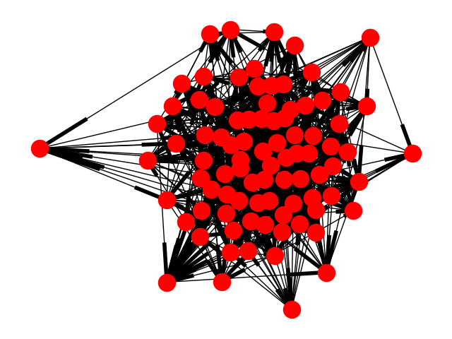

# Stream Demo
## Will Farmer


# Introduction

This project acts as a way to tinker with the Stream API and add some machine learning capabilities
with hopefully little overhead.

# Initial Steps

The first thing we need to do is to create a social network with impression/interaction history in
order to have some data to train on. We could do this one of two primary ways:
1. Just simulate events and pull from a random list of users, with the assumption that all users
   *can* react to every other user. The advantage of this approach is that it creates a
   mega-network with a ton of user interaction.
2. Simulate a social network from the ground up. This means starting by generating a finite list of
   users, giving each of them a couple friends, and then simulating events based on who they know.
   The advantage of this solution is two-fold, the first (and primary) being that it's a little more
   realistic. The second is that it creates a bunch of tiny social networks that interact with each
   other.
Currently we're using the second approach, since we wanted a more adaptive and flexible solution.

# Data Storage

Initially this was written with sqlite and ponyorm, but it was decided that Mongo *might* be a
better solution to more directly model the Stream API. This database consists of two main documents
that keep track of our entire (tiny) network.

## User Document

This document tracks user info which in our case is merely their name and a list of friends. In a
production scenario this could be easily extended. The schema is as follows:

```
{
    'name': <username>
    'friends': [
        <list of friend document object ids>
    ]
}
```

When we generate data this results in a quite dense social network.



## Activity Document

This tracks user events, which are closely modelled off of the [Stream API
Documentation](https://getstream.io/docs/python/). The schema is as follows:

```
{
    'actor': <user document object id>
    'verb': <'post'|'interact'>,
    'object': <object id if there is one>
    'time': <time of post>
    'message': <whatever the post contents are>,
    'topic': <topic of event (in this case post)>,
    'to': <user document object id, only in interact events>
}
```

This then gets sent right to the Stream API

# Hooking Up Stream

Stream's API is very easy to use. We're pulling all this code from [Stream's
Website](https://getstream.io/docs/python/).

```python
# Select user to tinker with?
chris = client.feed('user', 'chris')
# Add activity to their feed
chris.add_activity({
    'actor': 'chris',
    'verb': 'add',
    'object': 'picture:10',
    'foreign_id': 'picture:10',
    'message': 'This bird is absolutely beautiful. Glad it\'s recovering from a damaged wing.'
})
```
We start by just sending user follows to Stream, and then each of the events we post.

# Feed Types

## Flat Feed

We can generate a flat post feed by (provided a random user) filtering based on their friends (which
translates in this situation to who they follow) and sorting chronologically.

Stream's default feed is this flat feed. It's tricky to make this code easy to re-run and get the
same results because even though we can delete the MongoDB Database, it's trickier to do the same
for Stream. In the ideal world our flat feed should match the Stream feed perfectly, but in reality
since we don't delete data from Stream it doesn't.

## Personalized Feed

Now, if we want to add personalization we can use the `interact` type events instead of `post`
events.

For simplicity we assume that we can track and determine the "topic" of each post, and do a
user-by-user weighting based on these topics. This isn't exactly traditional *machine learning* but
instead an adaptive weighting algorithm. That being said, doing a "state of the art ML solution"
would be overkill here. After all, ["Perfect is the Enemy of
Good"](https://en.wikipedia.org/wiki/Perfect_is_the_enemy_of_good). I also realize that I'm kinda
glossing over a huge step here of how something like the post topic can be determined, but that's a
somewhat unrelated problem so I'm skipping past it.

Let's jump into how this thing works.

The first thing to realize is that we want any weighting system to decay over time, and *when* a
user interacts with a post will dictate how the weighting algorithm performs. We don't want to force
a user to look at the same sort of things always once the weights are settled, as individual's
interests adjust over time, and the easiest way to get bored of a platform is via repetition.

So what are the weights? In short they are small modifiers that are used to adjust the feed order.
In practice this means that every topic has an initial weight of 0 (its minimum) with maximum of 1.
As the user has more interactions with that topic, the more the weight jumps towards 1. This works
via the simple equation:

```python
def score_bump(score: float) -> float:
    return score + ((1 - score) / 2)
```

In other words, jump the score to the midpoint between its current value and 1. For example,

```
0 -> 0.5 -> 0.75 -> ... -> 1
```

In order to decay now we need to determine an easy way for it to drop back down to 0 after time
passes. To do this we use a [Logistic
Equation](http://mathworld.wolfram.com/LogisticEquation.html)'s first derivative and treat the
entire thing like a poor differential equation solver, more specifically like single-step
Runge-Kutta.

In other words, at each value of the score, we look at the slope of the logistic curve at that point
and jump forwards by the (normalized) amount of time elapsed since the last interaction we had. This
causes the score to decrease slowly initially, and then speed up the longer since interaction.

```python
def decay_func(x):
    return 2 / (1 + np.exp(5 * rate_parameter * x))

def decay_func_p(x):
    return (-2 * (5 * rate_parameter) * np.exp(5 * rate_parameter * x)) / ((np.exp(5 * rate_parameter * x) + 1) ** 2)
```

For a visual on this, see this pic.


This is perfect for us, since the longer it's been since a user interacts with a topic the less
likely it is that we want to filter on it.


Once we train our weights we just add them to the initial weights based off of the normalized
datetime of the post and resort based on these weights.

# Conclusion

Working with Stream is super straightforward, most of the effort in this project was used to setup a
flexible framework around which I could use Stream and neat ML stuff.

My personalized feed isn't perfect by a long shot, it overweights too much, but it's a good start.

If you have questions look on www.will-farmer.com for my email or make a public issue here.
